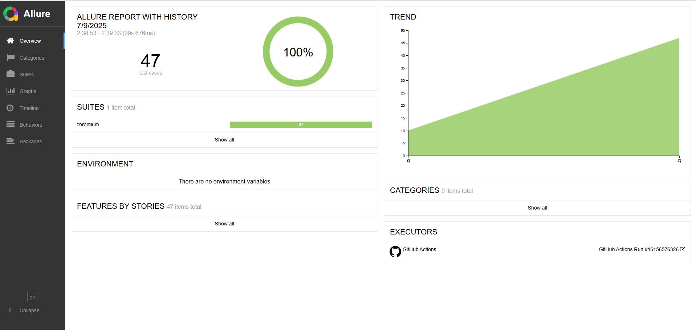
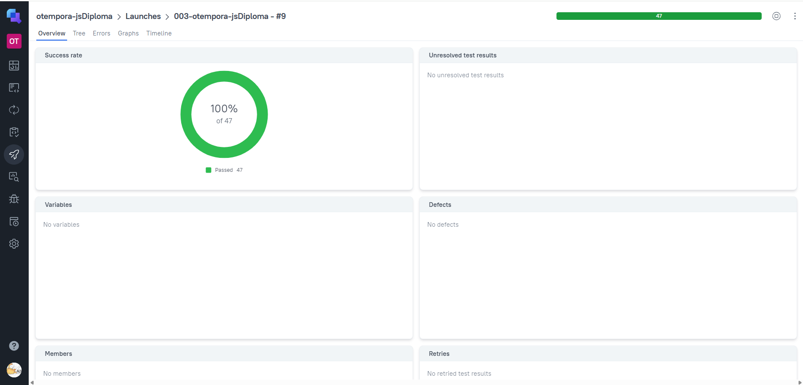
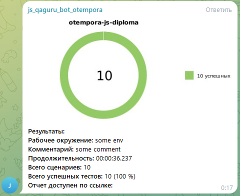

# Дипломный проект по итогам обучения на курсе QA.GURU | JS + Playwright QA.GURU | JS + Playwright | Автоматизация тестирования 4 поток

## Содержание
- [Описание](#Описание)
- [Технологический стек](#Технологический-стек)
- [Запуск тестов через Jenkins](#Запуск-тестов-через-Jenkins)
- [Локальный запуск тестов и генерация отчётов](#Локальный_запуск-тестов-и-генерация-отчётов)
- [Пример сформированного allure отчёта](#-Пример-сформированного-allure-отчёта)
- [Отчёт в Allure TestOps](#-Отчёт-в-Allure-TestOps)
- [Уведомления в Telegram](#-Уведомления-в-Telegram)


## Описание
Данный дипломный проект разработан в рамках курса по автоматизации тестирования. Репозиторий содержит набор UI и API тестов, написанных на языке JavaScript с использованием фреймворка Playwright. В качестве системы непрерывной интеграции и доставки применён GitHub Actions, выполняющий автоматический запуск тестов, формирование отчетов Allure, интеграцию с TestOps и отправку уведомлений в Telegram.

Объектами тестирования служат:

**selectel.ru** — веб-сайт, на которой реализованы практические задания для автоматизации интерфейсных тестов.

**apichallenges.herokuapp.com** — учебный сервис, предназначенный для освоения и отработки навыков тестирования API.

## Технологический стек


## Запуск тестов через Jenkins
Для запуска тестов необходимо авторизоваться на сайте Jenkins, перейти в нужную джобу и нажать Build Now. 
После завершения сборки будет сформирован Allure-отчет, содержащий детальную информацию о результатах тестирования.
Результаты сборки будут автоматически отправлены в Allure TestOps для дальнейшего анализа.
Уведомление о статусе выполнения будет отправлено в Telegram, что позволяет оперативно отслеживать результаты.

## Локальный запуск тестов и генерация отчётов

Команда для локального запуска тестов
```
npm run test
```
Команда для локального формирования отчёта
```
allure generate allure-results -o allure-report
allure open allure-report
```

## Пример сформированного allure отчёта
[Ссылка на отчёт](https://daria1004.github.io/jsDiploma)


## Отчёт в Allure TestOps
[Ссылка на проект](https://allure.autotests.cloud/launch/47233)


## Уведомления в Telegram
